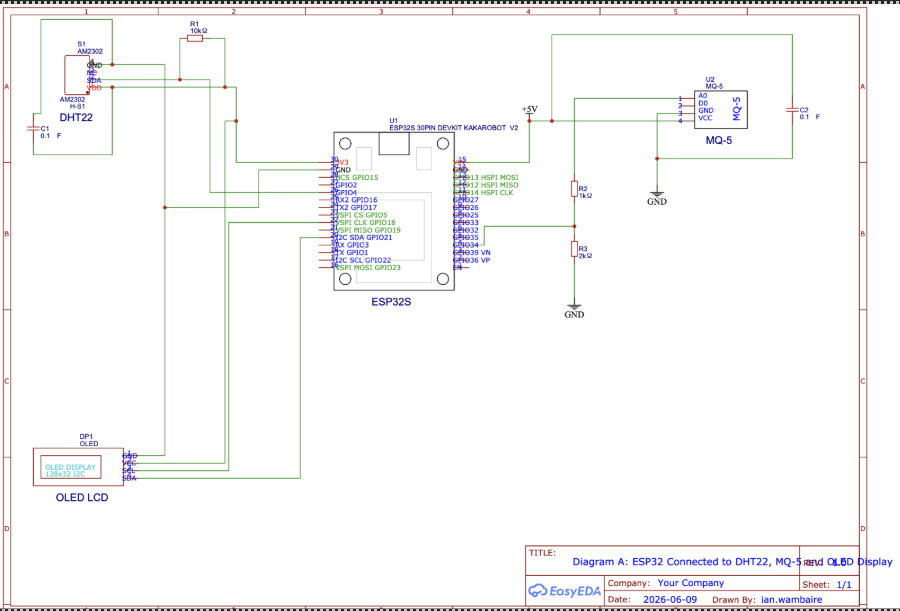
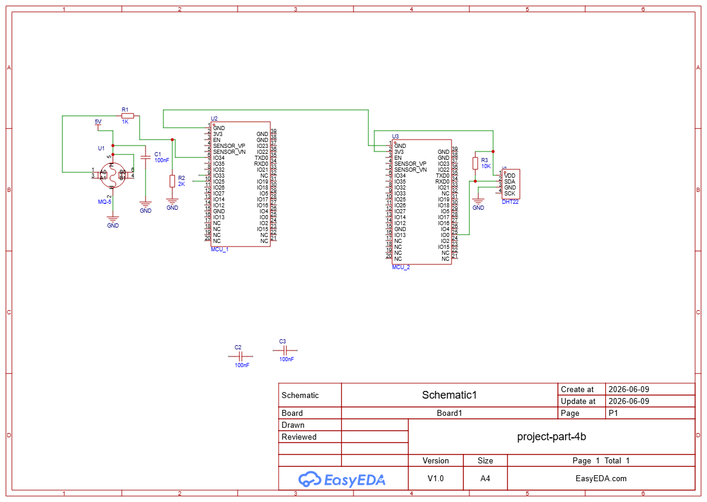
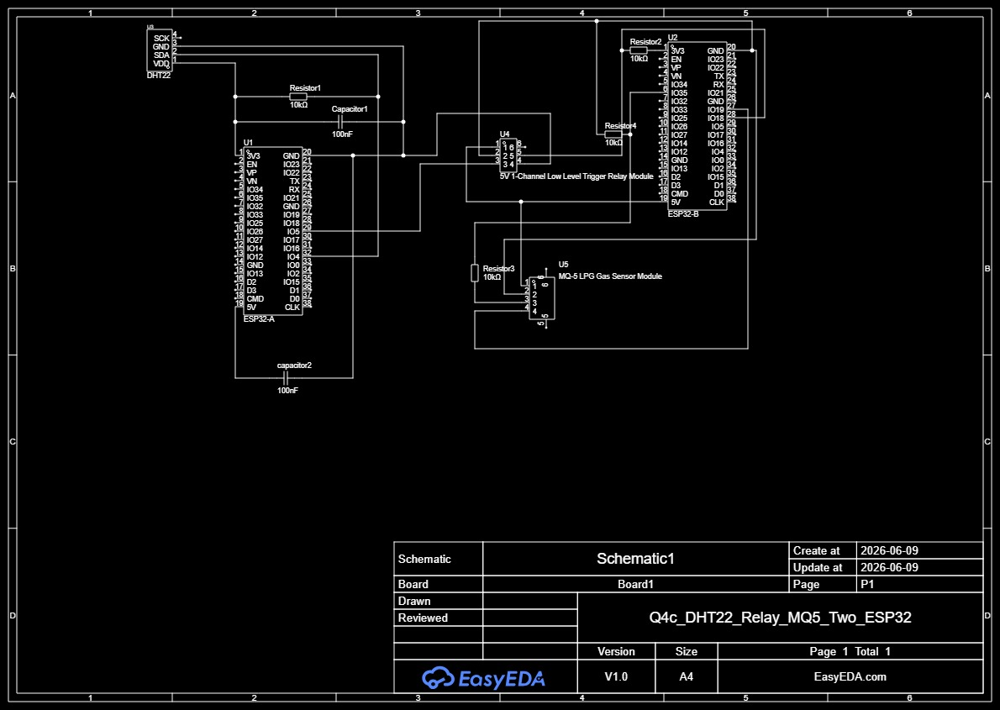

# ICS 4111: Embedded Systems & IoT
## Semester Project: Deliverable 1

**Objective:** Identify requirements that support individual flower growth and develop schematic designs of embedded devices.

### Group Details
**Group 6: The Starks**

| Student No. | Name |
| :--- | :--- |
| 159799 | Wambaire Ian Nganga |
| 156089 | Denzel Sam Omondi |
| 152803 | Kamau Edwin Kamau |
| 166993 | Njoroge Nancy Nduta |
| 163912 | Rurigi Maina |
| 168000 | Macklee Nderitu Gitonga |

---

### Question 1
**In your groups for the semester project, research on the environmental requirements that support proper growth of the flower as assigned to your group. Briefly describe and document the following characteristics for the growth of the flower: a. Optimal temperature range, b. Optimal relative humidity range, c. Recommended soil type, d. Optimal soil moisture content, e. Optimal soil pH range, f. Suitable number of hours to sunlight exposure. Have these measurements in a table that the team will reference to later in the project.**

| Flower Type | Optimal Temperature | Relative Humidity | Soil Type | Soil Moisture | Soil pH | Sunlight Exposure |
| :--- | :--- | :--- | :--- | :--- | :--- | :--- |
| **Sunflowers** | 20–25 °C germination; tolerate up to 30 °C | 55–70% | Loamy, nutrient-rich, well-drained | Deep watering weekly; avoid waterlogging | 6.0–7.5 | 6–8 hrs direct sun daily |

---

### Question 2
**Identify and list all suitable hardware components that you will need as a team to develop an embedded device for monitoring the environmental metrics listed in number 1. Part of the environmental measurements includes amount of LPG (methane/butane/propane). Note, that all hardware components include tools used for prototyping e.g. breadboards and jumper wires.**

To design a Wi-Fi-enabled embedded device for greenhouse monitoring, sensors and prototyping tools will be needed:

* **Temperature & Humidity:** DHT22 or SHT31 sensor (accurate temp & RH monitoring).
* **Soil Moisture:** Capacitive soil moisture sensor (non-corrosive, reliable).
* **Soil pH:** Analog pH sensor probe (with calibration solution).
* **Light Intensity (Sunlight exposure):** BH1750 or TSL2561 light sensor.
* **Gas Monitoring (LPG usage):** MQ-6 or MQ-5 gas sensor (detects propane, butane, methane).
* **Power Management:** * ESP32/ESP8266 microcontroller (Wi-Fi enabled, low power).
  * Voltage regulators to match 12V battery setup.
* **Prototyping Tools:** Breadboards, jumper wires, resistors, capacitors.
* **Multimeter for calibration.** * **Solar charge controller integration for energy balance.**

#### Risks & Considerations
* **Sensor Calibration:** Soil pH and moisture sensors require regular calibration for accuracy.
* **Power Constraints:** Devices must be optimized for solar + 12V battery setup.
* **Connectivity:** Ensure routers in each greenhouse can handle multiple IoT nodes.
* **Environmental Stress:** High humidity may affect sensor lifespan; waterproof casing is recommended.

---

### Question 3
**Retrieve datasheets for these components and include their links to your project document. If datasheets are unavailable, you can include webpages describing the product:**

The following datasheets and reference links have been retrieved for the five specified hardware components:

* **a. 1.3" White IIC 128X64 OLED LCD**
  * [Datasheet (controller): SSD1306 Datasheet (PDF)](https://cdn-shop.adafruit.com/datasheets/SSD1306.pdf)
  * [Product reference: Adafruit 1.3" 128x64 OLED – Product ID 938](https://www.adafruit.com/product/938)
* **b. ESP32S DevKIT WIFI + BLE Module (30Pin)**
  * [User guide: ESP32‑S3‑DevKitC‑1 Getting Started Guide](https://docs.espressif.com/projects/esp-idf/en/latest/esp32s3/hw-reference/esp32s3/user-guide-devkitc-1.html)
  * [Chip datasheet: ESP32‑S3 Datasheet (PDF)](https://www.espressif.com/sites/default/files/documentation/esp32-s3_datasheet_en.pdf)
* **c. DHT22 AM2302 Temperature and Humidity Sensor**
  * [Datasheet: DHT22 Datasheet (PDF)](https://www.sparkfun.com/datasheets/Sensors/Temperature/DHT22.pdf)
  * [Product page: Adafruit DHT22 Overview](https://learn.adafruit.com/dht)
* **d. MQ-5 LPG, natural gas, coal gas Sensor**
  * [Manufacturer page: Winsen MQ‑5 Semiconductor Sensor for Flammable Gas](https://www.winsen-sensor.com/sensors/flammable-gas-sensor/mq-5.html)
  * [Direct datasheet (PDF): MQ‑5 Ver1.4 Manual](https://www.components101.com/sites/default/files/component_datasheet/MQ5%20Gas%20Sensor%20Datasheet.pdf)
* **e. 5V 1-Channel Low Level Trigger Relay Module**
  * [Internal relay datasheet (Songle SRD‑05VDC‑SL‑C): SRD Series Datasheet (PDF)](https://www.components101.com/sites/default/files/component_datasheet/5V%20Relay%20Datasheet.pdf)
  * [Module explanation & schematic: How to Set Up a 5V Relay on Arduino](https://create.arduino.cc/projecthub)

---

### Question 4
**Develop schematic diagrams of the following architectures based on the listed components in number 3, each listed item represents one design. Note: the expected level of detail in your circuit diagrams should be similar to figure 7 in this research paper or the example given on e-learning. Include appropriate electric components such as resistors, capacitors and voltage dividers in your circuits.**

#### a. 1 ESP32S connected to 1 MQ-5, 1 DHT22 and 1 LCD

#### b. 1 ESP32S connected to 1 MQ-5 interfaced directly with another ESP32S connected to 1 DHT22

#### c. 1 ESP32S connected to 1 DHT22 connected to 1 relay which is connected to another ESP32S connected to 1 MQ-5
