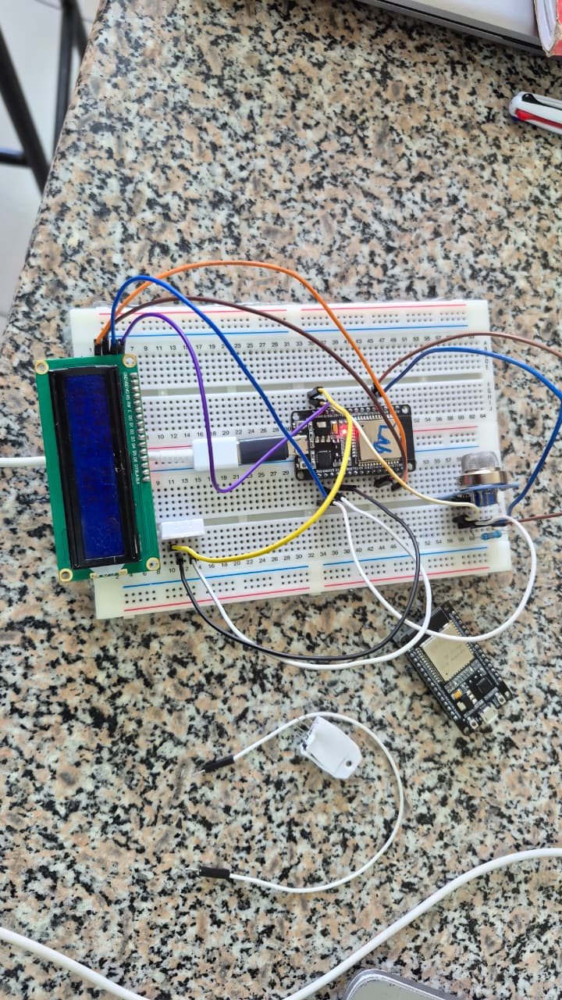
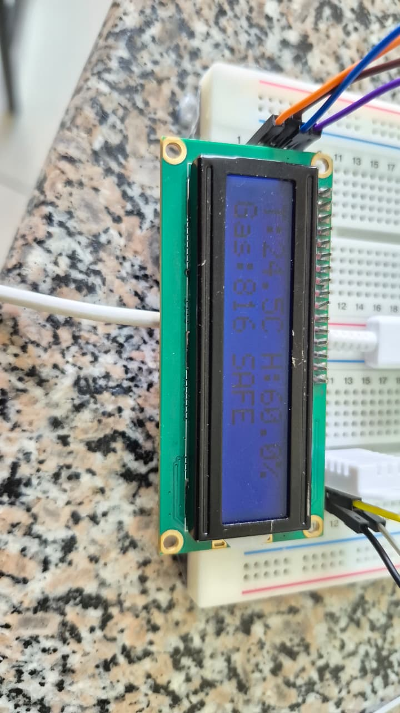
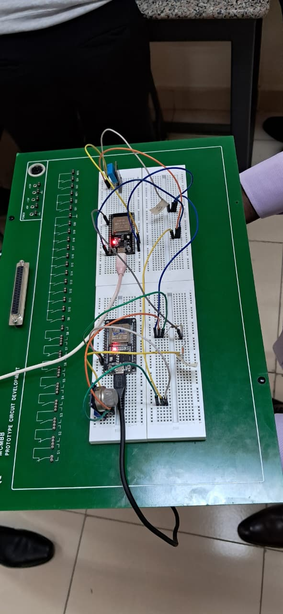
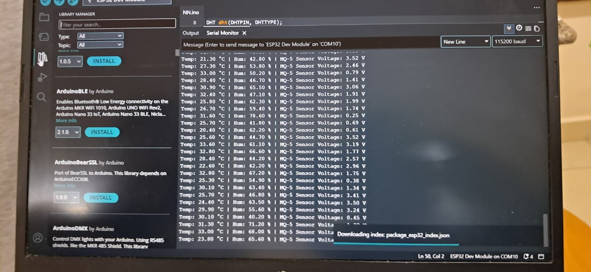

# ICS 4111: Embedded Systems & IoT
## Semester Project: Deliverable 2

**Objective:** Develop prototypes of embedded devices.

### Group Details 
**Group 6: The Starks**

| Student No. | Name |
| :--- | :--- |
| 159799 | Wambaire Ian Nganga |
| 156089 | Denzel Sam Omondi |
| 152803 | Kamau Edwin Kamau |
| 166993 | Njoroge Nancy Nduta |
| 163912 | Rurigi Maina |
| 168000 | Macklee Nderitu Gitonga |

---

**Team Prototype Testing Session:**

---

### Deliverable Instructions
**Using the schematics from Deliverable 1, create physical and simulated prototypes based on these device architectures. Simulations will be done through Wokwi:**

---

### a. 1 ESP32S connected to 1 MQ-5, 1 DHT22 and 1 LCD
*(Both physical and simulated models are expected)*

**1. Simulated Model**
* **Wokwi Project Link:** https://wokwi.com/projects/467691136827675649

**2. Physical Model**
* **Hardware Setup:** 
* **LCD Output Display:** 

---

### b. 1 ESP32S connected to 1 MQ-5 interfaced directly with another ESP32S connected to 1 DHT22
*(Develop EITHER a physical or simulated model)*

**1. Physical Model**
* **Hardware Setup:**  

* **IDE Serial Monitor Output (Showing combined data stream):**  

---

### c. 1 ESP32S connected to 1 DHT22 connected to 1 relay which is connected to another ESP32S connected to 1 MQ-5
*(Develop EITHER a physical or simulated model)*

**1. Simulated Model**
* **Wokwi Project Link:** https://wokwi.com/projects/468278859076488193

---

### Technical Prototyping Issues & Recommendations Log

**If by chance you experience technical prototyping issues that couldn’t be resolved before the deliverable due date, ensure your clearly document the problem, all possible solutions explored and recommend for any changes to resolve the issue.**

* **Issue 1: Missing MQ-5 in Simulation Environment (Architecture A)**
  * **Problem:** The MQ-5 gas sensor was unavailable in the Wokwi component library during the simulation build for Architecture A.
  * **Solutions Explored:** We explored creating a custom part JSON, but it proved unstable for environmental variance. 
  * **Recommendation/Workaround:** We substituted the MQ-5 with a **potentiometer** in the simulation. Since the MQ-5 outputs an analog voltage proportional to gas concentration, a potentiometer serves the same purpose by providing a variable analog signal, successfully mimicking the sensor's output to test our firmware's environmental state changes without delaying the prototype.

* **Issue 2: Display Component Substitution (Architecture A)**
  * **Problem:** The original schematic designated an I2C OLED display (128x32). Due to lab component availability constraints, we could not source this exact screen.
  * **Solution Implemented:** We substituted the OLED with a 16x2 Character LCD using an I2C adapter backpack. Firmware dependencies were updated from `Adafruit_SSD1306` to the `LiquidCrystal_I2C` library.